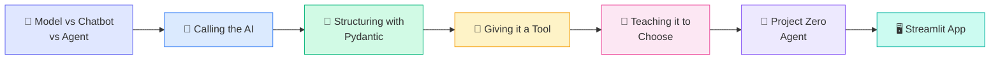

# Basics

> Build an agent from scratch — no framework, just Python.

[](#the-learning-path)

**Goal:** Understand what an agent actually is — and build one yourself, line by line.

Each file is self-contained and builds on the previous one. Run them in order.

---

## Quick start

From the project root, create a `.env` with at least one API key:

```env
# Free providers (recommended to start)
GROQ_API_KEY=...
OPENROUTER_API_KEY=...

# Paid providers (optional)
OPENAI_API_KEY=...
ANTHROPIC_API_KEY=...
```

Run any script:

```bash
uv run python Basics/ai_model_vs_chatbot_vs_agent.py
uv run python Basics/calling_the_ai.py
# ... and so on
```

Capstone UI:

```bash
uv run streamlit run Basics/streamlit_app.py
```

---

## Learning path



---

## The learning path

<table>
<tr>
<td width="50%">

#### 1 · Concepts — no API needed

| File | Focus |
|------|-------|
| [`ai_model_vs_chatbot_vs_agent.py`](ai_model_vs_chatbot_vs_agent.py) | Plain Python classes that show the *shape* of model → chatbot → agent |

**Key idea:** A model predicts once. A chatbot remembers. An agent can *act*.

</td>
<td width="50%">

#### 2 · Talk to a real model

| File | Focus |
|------|-------|
| [`calling_the_ai.py`](calling_the_ai.py) | Four providers — Groq, OpenRouter, OpenAI, Anthropic |

**Key idea:** Messages in, string out. Free providers first, paid as fallback.

</td>
</tr>
<tr>
<td>

#### 3 · Trust the output

| File | Focus |
|------|-------|
| [`structuring_with_pydantic.py`](structuring_with_pydantic.py) | Extract structured JSON from free-form replies |

**Key idea:** Never trust raw model text downstream — validate with Pydantic first.

</td>
<td>

#### 4 · Wire up a tool (manually)

| File | Focus |
|------|-------|
| [`giving_it_a_tool.py`](giving_it_a_tool.py) | Extract a city → call `get_weather()` yourself |

**Key idea:** *You* decide when and how to call the tool — the model only extracts fields.

</td>
</tr>
<tr>
<td>

#### 5 · Let the model choose

| File | Focus |
|------|-------|
| [`teaching_it_to_choose.py`](teaching_it_to_choose.py) | Tool schemas — the model picks `get_weather` vs `get_capital` |

**Key idea:** Hand the model a menu of tools; read its `tool_calls` response.

</td>
<td>

#### 6 · The full agent loop

| File | Focus |
|------|-------|
| [`project_zero_agent.py`](project_zero_agent.py) | Choose → execute → observe → repeat until done |

**Key idea:** The agent loop with conversation memory and a terminal REPL.

</td>
</tr>
<tr>
<td colspan="2">

#### 7 · Capstone — put it in a UI

| File | Focus |
|------|-------|
| [`streamlit_app.py`](streamlit_app.py) | Chat UI with weather, calculator, and live currency conversion |

**Run it:**

```bash
uv run streamlit run Basics/streamlit_app.py
```

**Key idea:** Same agent loop from step 6 — now with three tools and a web interface.

</td>
</tr>
</table>

---

## What you built by the end

```
User question
     │
     ▼
┌─────────────┐     tool_calls?     ┌──────────────┐
│  LLM (brain) │ ─────────────────► │ Execute tool │
└─────────────┘                     └──────────────┘
     │                                      │
     │         ◄──── tool result ───────────┘
     ▼
 Final answer
```

| Piece | Where it lives |
|-------|----------------|
| **Brain** | OpenAI-compatible chat completions (Groq / OpenRouter / OpenAI) |
| **Memory** | Plain `list[dict]` of messages |
| **Tools** | Plain Python functions + JSON schemas |
| **Loop** | `run_agent()` — call model, execute tools, feed results back |
| **UI** | Streamlit chat (optional capstone) |

---

## Files in this folder

```
Basics/
├── ai_model_vs_chatbot_vs_agent.py   # Step 1 — concepts, no API
├── calling_the_ai.py                 # Step 2 — four LLM providers
├── structuring_with_pydantic.py      # Step 3 — structured extraction
├── giving_it_a_tool.py               # Step 4 — manual tool pipeline
├── teaching_it_to_choose.py          # Step 5 — model picks the tool
├── project_zero_agent.py             # Step 6 — full agent loop + REPL
├── streamlit_app.py                  # Step 7 — capstone chat UI
└── README.md                         ← you are here
```

---

## Dependencies used here

| Package | Used in |
|---------|---------|
| `openai` | LLM calls (OpenAI, Groq, OpenRouter) |
| `anthropic` | Claude API |
| `pydantic` | Structured extraction |
| `python-dotenv` | Loading `.env` keys |
| `streamlit` | Chat UI capstone |
| `requests` | Live currency conversion in Streamlit app |
